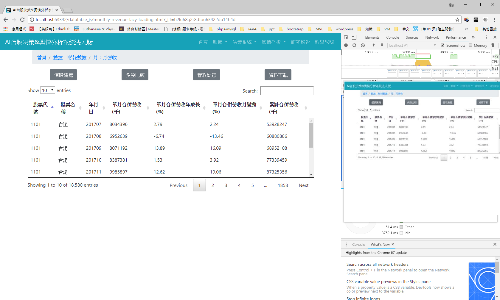
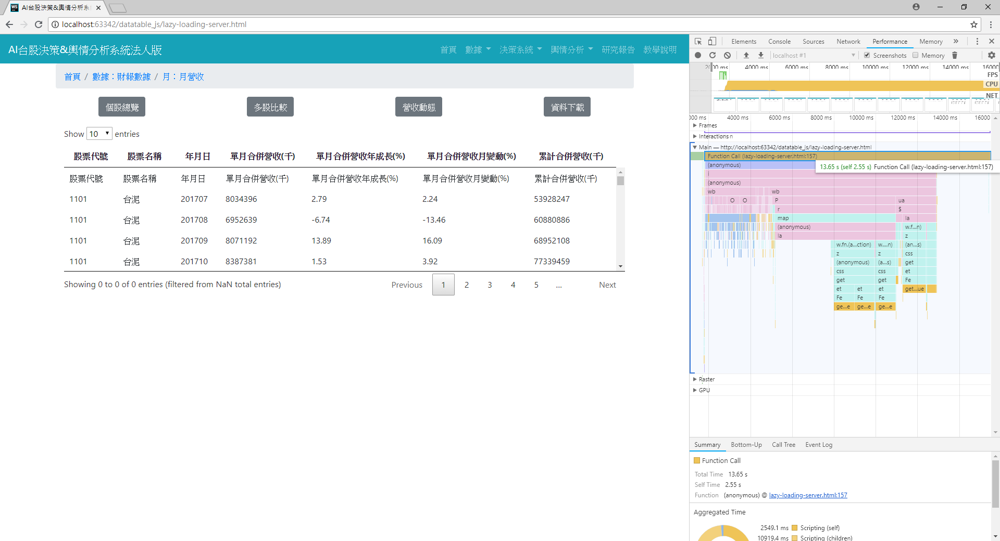

# datatable_practice
* `lazy-loading-client.html` is the best solution for data size between 5,000 to 50,000. For 18,000 rows, it takes less then 1 sec to load.

* `lazy-loading-server.html` has been facing a loading timeout issue.
> Will require a server side application to deal with responses.

